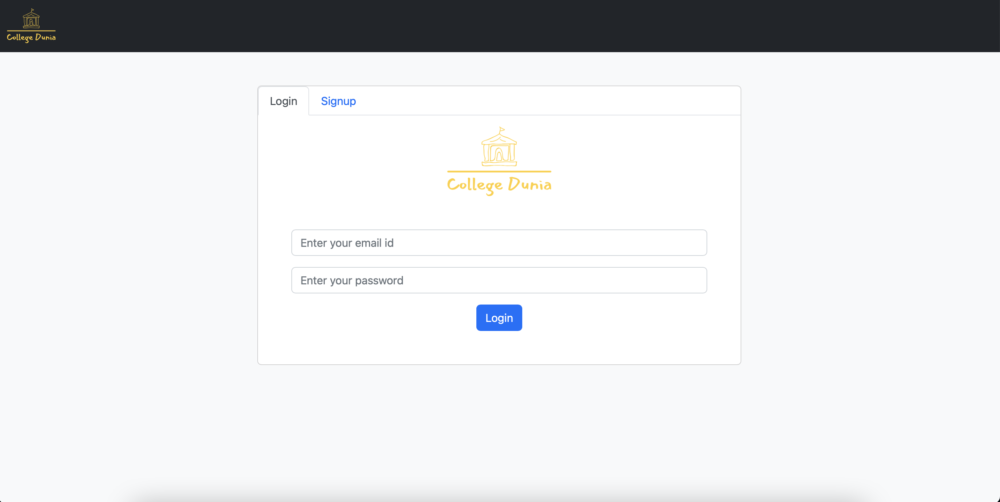
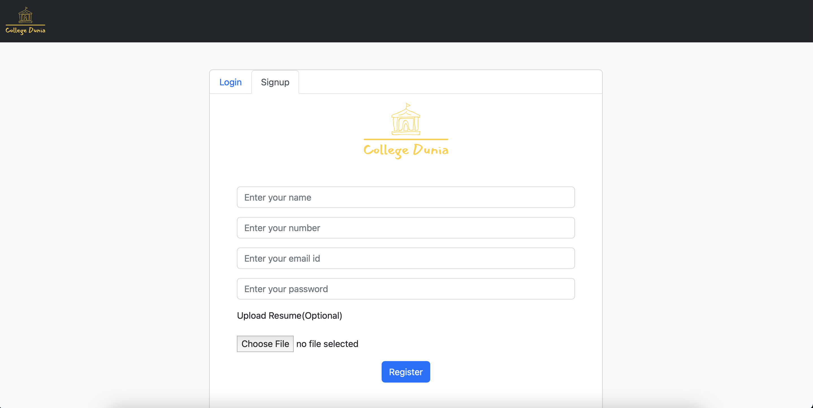
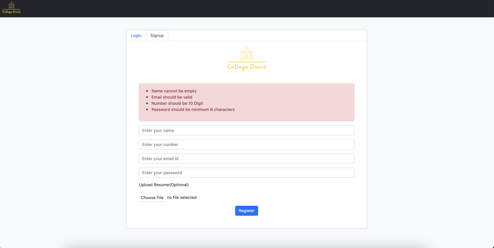
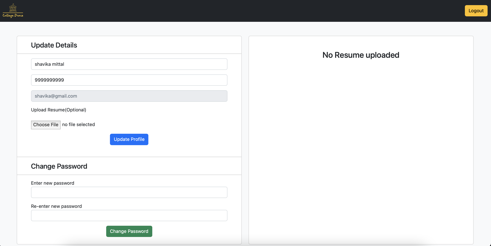
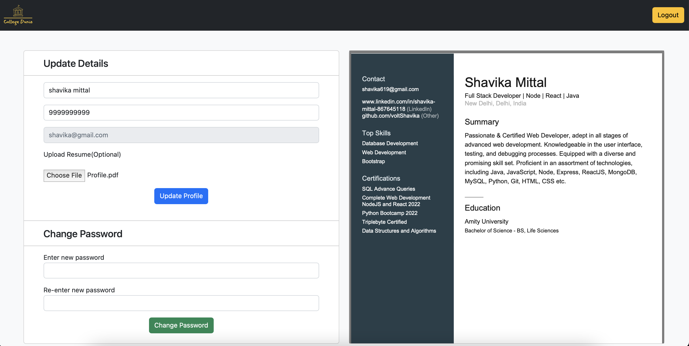
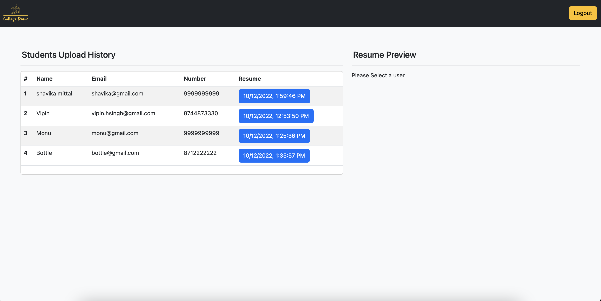
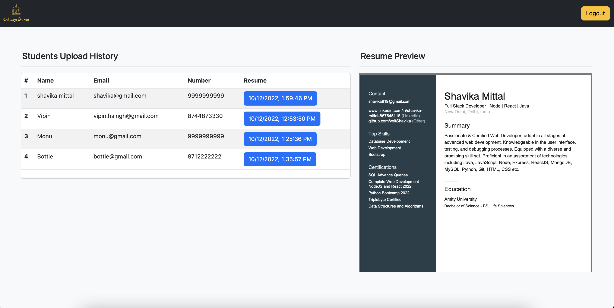

# College Dunia

A College ERP system for students and staff

### Setup Instructions

Clone project somewhere by running `git clone https://github.com/voltShavika/college_erp` and `cd college_erp`
#### 1. Node Server
1. go to `server` directory
2. run `npm install`
3. run the server by `node app.js`. Now you server should be running on `http://localhost:8000`.
4. Now go to browser and hit this url `http://localhost:8000/api/dbinit/`. This loads by default Student and Staff user
5. you can view the details like `email` and `password` of these users in `server/dummy_data.js`

#### 2. React Server
1. go to `client` directory
2. run `npm install`
3. run `npm start` . Now your frontend should be running on `http://localhost:3000/`

NOTE: If your node server is not running `http://localhost:8000`. then make sure you change `pref` variable in `client/src/api.js`. Otherwise APIs will not work.

## UI Instructions

1. There is only one landing page at `http://localhost:3000`. 
2. You will have Login and Signup page on the same page itself.
3. You can signup without uploading Resume File. But in case you do upload a file, it will only accpet .pdf format.
4. Email should be unique at the time of signup
5. If you logged in as a Student. Then you will have Profile Update, Resume Upload, Change Password and you can also view your uploaded Resume if any.
6. If logged in as a Staff. You will have information of those students who uploaded a resume. Non resume uploaders will *NOT* be displayed.
7. You can download the resume as well.

NOTE: All Form fields have Basic form validations.

Thats all!!!

#### 1. Landing Page

#### 2. Signup Tab

#### 3. Form Validations

#### 4. Student Login In case on No Resume

#### 5. Student Login In case on  Resume Uploaded

#### 6. Admin Login Landing

#### 7. Admin Resume Selected

